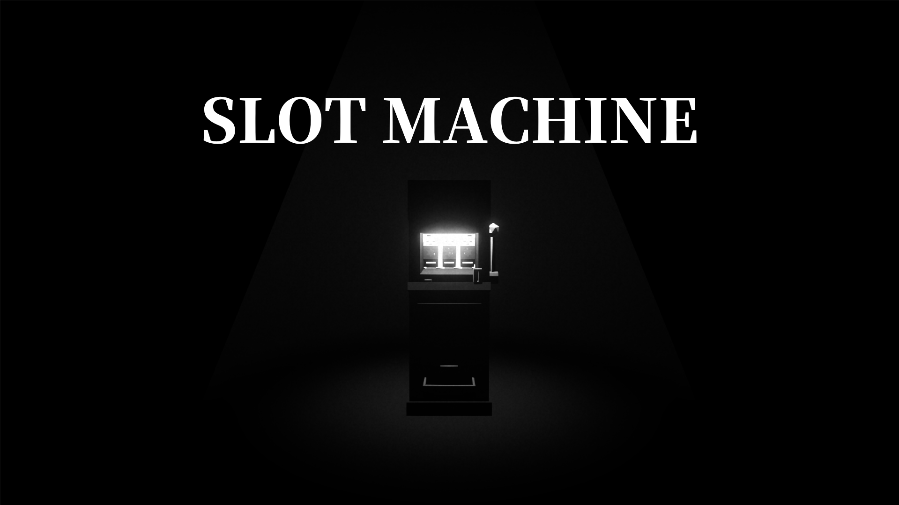

<p align="center">
  <a href="https://le-0409.github.io/SlotMachine-NHN/">
    
  </a>
</p>

# SLOT MACHINE

전등 하나가 켜진 독방. 그 안에 슬롯머신 하나와 동전 세 개가 있다.

**▶ 브라우저에서 바로 하기 — <https://le-0409.github.io/SlotMachine-NHN/>**

PC · 모바일 모두 브라우저에서 돌아간다. 첫 화면에서 `PC` 또는 `MOBILE` 을 고른다.
가로로 든 화면이 필요하다 — 세로로 들면 돌려 달라는 안내가 덮는다.

> 이 저장소는 **Unity 게임 하나를 처음부터 Claude Code 로 만든 기록**이다.
> 게임 자체보다 **어떻게 만들었는지**가 남기려던 것이라, 아래 「어떻게 만들었나」와
> 「AI 를 어떻게 썼나」가 이 README 의 본문이다.

---

## 무엇을 하는 게임인가

동전을 슬롯머신에 넣고 레버를 당긴다. 동전 하나가 크레딧 하나, 크레딧 하나가 스핀 한 번이다.

| | 조건 | 배당 |
|---|---|---|
| 큰 성공 | 세 릴이 다 같음 (1/64) | 동전 100개 |
| 작은 성공 | 둘만 같음 (21/64) | 동전 10개 |

릴은 면 8개짜리 드럼 3개다. 확률은 여기서 나온 값이고, 배당은 그 확률과 짝을 이루도록
`Assets/Scripts/Slot/SlotMachine.cs` 한 곳에 같이 두었다.

작은 성공이 잦은 것은 의도다 — 기계가 계속 반응해야 살아 있어 보인다.
그리고 **처음 세 번은 확률을 따르지 않는다.** 시작 동전이 세 개이므로 그 세 번이 곧 첫 판
전부라, 두 번 빈손으로 애태우고 세 번째에 두 개를 맞춰 밑천을 준다
(`SlotMachine.ScriptedOpening`). 그 뒤부터는 순수 난수다.

딴 동전은 트레이로 쏟아진다. 주워서 다시 넣거나, 인벤토리에 넣어 두거나,
환불 버튼으로 남은 크레딧을 되받을 수 있다.

## 조작

| 동작 | PC | 모바일 |
|---|---|---|
| 시야 | 마우스 | 화면 오른쪽을 끈다 |
| 걷기 | `WASD` · 방향키 | 왼쪽 아래 조이스틱 |
| 사용 — 조준한 것과 상호작용 / 들고 있으면 놓기 | 좌클릭 | `USE` |
| 넣기 — 든 동전을 인벤토리로 | `E` | `STORE` |
| 꺼내기 — 인벤토리에서 하나 꺼내 들기 | `Q` | `TAKE` |
| 커서 해제 | `Esc` | — |

조준점은 항상 떠 있고, 쓸 수 있는 것을 보면 커지고 또렷해진다.
레버가 강조되지 않으면 크레딧이 없는 것이다 — 동전을 먼저 넣는다.

에디터에서도 `MOBILE` 을 눌러 마우스로 터치 조작을 확인할 수 있다.

## 직접 열어 보려면

**Unity 6000.3.10f1 (Unity 6.3)** 이 필요하다.

```bash
git clone https://github.com/LE-0409/SlotMachine-NHN.git
```

프로젝트를 열고 `Assets/Scenes/CellRoom.unity` 를 Play 하면 된다. 씬은 이것 하나뿐이다.

Unity 프로젝트 폴더와 어셈블리 이름(`NHNAI.Game` · `NHNAI.UI`)은 `NHNAI` 다 —
저장소 이름과 다르니 경로에서 보고 놀라지 않아도 된다.

Blender 는 **필요 없다.** 3D 에셋이 `.fbx` 로 커밋되어 있다. 모델을 다시 만들 때만 쓴다
(→ [ArtPipeline](#3d-에셋은-blender-스크립트가-만든다)).

씬·머티리얼·UI 기반은 손으로 만든 것이 아니라 에디터 메뉴가 생성한다.

```
NHNAI > Setup  > 1. 아트 머티리얼 생성 · 갱신
NHNAI > Setup  > 2. PanelSettings 생성 · 갱신
NHNAI > Scenes > 독방 (CellRoom)     ← 씬 전체를 통째로 다시 만든다
NHNAI > Build  > WebGL → WebGLBuild
```

---

## 어떻게 만들었나

한 줄로 말하면 **손으로 만든 것이 거의 없다.** 결과물이 아니라 결과물을 만드는 코드를
커밋했고, 그래서 전부 다시 생성할 수 있다.

| 보통 손으로 하는 것 | 이 저장소가 한 것 | 정본 |
|---|---|---|
| 씬에 오브젝트를 끌어다 놓고 조명 값을 굴린다 | 씬을 **에디터 코드가 생성**한다 | `Assets/Editor/CellRoomBootstrap.cs` |
| 3D 모델을 Blender GUI 에서 만든다 | Blender 를 **헤드리스로 돌려 Python 이 만든다** | `ArtPipeline/assets/*/generate_*.py` |
| UI 를 씬 안에서 눈으로 맞춘다 | **HTML/CSS 로 먼저 잡고** UXML/USS 로 옮긴다 | `prototype/*.html` |
| 머티리얼을 인스펙터에서 만든다 | 코드가 생성하고 FBX 머티리얼을 리맵한다 | `Assets/Editor/ArtMaterialLibrary.cs` |

`.unity` 씬과 `PanelSettings.asset` 은 GUID 참조가 들어간 YAML 이라 손으로 쓰면 깨진다.
그래서 **씬은 산출물로 취급한다** — 인스펙터에서 값을 굴려 찾는 것은 정상적인 작업이지만,
찾은 값은 부트스트랩에 옮겨 적고 메뉴를 다시 돌려 확정한다. 씬에만 남긴 값은
다음 생성에서 사라진다.

이 구조의 값은 "재현 가능"보다 **"AI 가 고칠 곳이 하나"** 라는 데 있다.
조명이 어두우면 씬을 뒤질 필요 없이 `BuildLighting()` 을 고친다.

### 3D 에셋은 Blender 스크립트가 만든다

스토어 에셋도, 외부 AI 3D 생성 서비스도 쓰지 않았다. 파이썬이 정점을 찍는다.

```powershell
cd ArtPipeline
.\setup.ps1                                                   # Blender 준비 (1회)
.\run_blender.ps1 assets\slot_machine\generate_slot_machine.py
```

생성 스크립트 4개(독방 · 슬롯머신 · 전등 · 동전)가 FBX 5개를 뱉는다 — 전등 스크립트가
빛 기둥 메시까지 같이 만든다. 색은 `ArtPipeline/project/palette_registry.py` 한 곳이
정본이고, 모든 에셋이 **무채색 10단계 팔레트 텍스처 하나**를 UV 로 가리켜 드로우 콜을 줄인다.

핵심은 **생성 스크립트가 FBX 와 함께 턴어라운드 프리뷰 PNG 를 같이 뱉는다**는 것이다.
Unity 를 열지 않고 렌더를 눈으로 보고 다음 수정으로 간다 — 이 루프가 AI 에게
"내가 만든 것이 어떻게 생겼는지" 를 확인할 수단을 준다.

> `ArtPipeline/` 은 다른 저장소에서 가져온 **벤더링된 공용 kit** 이다 (출처는
> `ArtPipeline/KIT-ORIGIN.txt` 의 commit 해시). 이 프로젝트가 실제로 쓴 것은 메시 빌더 ·
> 팔레트 · 익스포트 · 프리뷰 네 모듈이고, 리깅·애니메이션 모듈과 kit 설치 도구는
> 쓰지 않았다. 상위 kit 과 diff 를 유지하려고 그대로 두었다.

### UI 는 브라우저에서 먼저 확정한다

스크린 스페이스 UI 는 전부 **UI Toolkit** 이다 (uGUI 는 한 곳도 쓰지 않았다).
UXML/USS 는 Unity 를 켜야 보이는데 반복이 느려서, 먼저 브라우저에서 잡는다.

```
prototype/main-menu.html        →  Assets/UI/Screens/MainMenu/
prototype/mobile-controls.html  →  Assets/UI/Screens/MobileControls/ + Components/
prototype/rotate-gate.html      →  Assets/UI/Screens/RotateGate/
```

USS 는 CSS 의 부분집합이라 `grid` · `z-index` · `gap` · `box-shadow` · `@keyframes` 가 없다.
프로토타입은 **애초에 그것들을 쓰지 않고** 짠다 — 변환 규칙은 `prototype/README.md`.

씬은 하나뿐이라 메인메뉴도 씬이 아니라 `CellRoom` 위에 겹치는 층이다.
그래서 메뉴가 떠 있는 동안에도 방이 뒤로 비치고 배경음이 끊기지 않는다.

### 화면 문구가 전부 영어인 이유

`PanelSettings` 에 FontAsset 을 물리지 않아 UI Toolkit 이 기본 폰트로 그리는데,
거기에는 **라틴 문자만** 들어 있다. 에디터에서는 OS 폰트가 뒤를 받쳐 줘서 한글이 보이지만
네이티브·WebGL 빌드에는 그 폴백이 없다 — 오류도 로그도 없이 글자만 사라진다.

모바일 조작 버튼에서 실제로 겪었고(`c0a9fa5`), 그래서 화면에 나가는 문구는 전부 영어다.
주석과 문서는 한국어 그대로다 — 화면에 안 나가는 글자는 폰트와 무관하다.

### 배포

WebGL 빌드를 `gh-pages` 브랜치로 올린다.

```powershell
# Unity 메뉴에서 NHNAI > Build > WebGL → WebGLBuild 실행 후
.\Tools\deploy-webgl.ps1
```

wasm 은 diff 가 안 되는 바이너리라 **부모 없는 커밋 하나로 매번 덮어쓴다.**
히스토리를 남기면 저장소가 배포 횟수에 비례해 커진다.

배포 스크립트는 푸시 **전에** 빌드 설정을 검사한다. GitHub Pages 는 커스텀 응답 헤더를
못 주기 때문에 Brotli 압축을 켜고 Decompression Fallback 을 끄면 페이지가 조용히 빈
화면이 된다 — 그 조합을 올라가기 전에 막는다.

---

## AI 를 어떻게 썼나

전부 [Claude Code](https://claude.com/claude-code) 로 만들었다. 이 절은 "AI 를 썼다" 가
아니라 **무엇을 해서 왕복을 줄였는지**를 저장소에서 확인할 수 있는 것만 적는다.

### 1. 규칙을 매번 설명하지 않는다 — `CLAUDE.md`

세션마다 다시 말해야 하는 것들(어떤 UI 프레임워크를 쓰는지, 씬을 손으로 고치면 안 되는
이유, 커밋 형식)을 한 파일에 못 박았다. 새 세션은 이걸 읽고 시작하므로 같은 설명이
반복되지 않는다.

### 2. 한 번 밟은 함정은 문서가 대신 기억한다

`CLAUDE.md` 의 「디버깅 도구」 표는 일반적인 팁 모음이 아니라 **이 프로젝트에서 실제로
겪은 증상 → 원인** 목록이다.

| 증상 | 원인 |
|---|---|
| 빌드에서만 버튼 글자가 빈칸 | 문구에 한글. 기본 폰트에 글리프 없음 |
| WebGL 페이지가 비고 `Unable to parse Build/*.br!` | Decompression Fallback 꺼진 채 빌드 |
| 모바일 조작 UI 가 보이는데 안 눌림 | `InputSystem_Actions` 의 `UI` 액션 맵 |
| PC 를 골랐는데 시야가 안 돌아감 | 브라우저가 포인터 잠금 거부 |

전부 **에디터에서는 재현되지 않는** 종류다. AI 는 재현되지 않는 버그를 추측으로 파기
쉬운데, 증상을 원인에 미리 묶어 두면 그 탐색이 사라진다. 겪을 때마다 한 줄씩 늘렸다.

### 3. 참조 문서를 저장소 안에 둔다

`docs/reference/unity-ui-toolkit/` 에 UI Toolkit 문서 11페이지를 벤더링했다.
USS 가 어떤 CSS 속성을 지원하는지 같은 질문은 웹 검색 왕복 대신 **파일 읽기 한 번**으로
끝난다. 저장소가 자기완결이라 클론만 해도 같은 근거를 본다.

### 4. 반복 절차는 스킬로 굳힌다

`.claude/skills/unity-ui-prototype/` — 화면 프로토타입 만드는 절차(지켜야 할 USS 제약,
파일 짝 이름, 완료 기준)를 스킬로 두었다. 절차를 매번 프롬프트로 다시 쓰지 않는다.

### 5. 독립적인 작업은 worktree 로 동시에

서로 안 겹치는 작업은 별도 worktree 에서 병렬로 돌리고 병합했다.
히스토리에 merge 커밋으로 남아 있다.

```
1b80900 Merge branch 'worktree-coin-inventory'
1d99085 Merge branch 'worktree-slot-win-sounds'
03e8e51 Merge branch 'worktree-sound-work'
```

### 6. AI 가 자기 결과를 눈으로 볼 수 있게 한다

가장 효과가 컸던 것. AI 는 Unity 에디터 화면을 볼 수 없으므로, **볼 수 있는 산출물**을
파이프라인마다 끼워 두었다.

| 무엇을 만들 때 | 확인 수단 |
|---|---|
| 3D 에셋 | 생성 스크립트가 턴어라운드 PNG 를 같이 뱉는다 |
| UI 화면 | 브라우저에서 여는 HTML 프로토타입 |
| 씬 구성 | 부트스트랩을 다시 돌려 결과를 비교 |

"고쳤습니다" 로 끝나지 않고 결과를 확인한 다음 넘어갈 수 있다.

### 7. 정본을 하나로 만든다

같은 값이 두 곳에 있으면 AI 는 한 곳만 고친다. 그래서 갈래를 미리 막았다.

| 무엇 | 유일한 문 |
|---|---|
| 조작 입력 | `PlayerInputSource` — 게임 코드는 `Keyboard.current` 를 직접 읽지 않는다 |
| 씬 구성·조명 | `CellRoomBootstrap.cs` |
| 에셋 색 | `palette_registry.py` (선언 순서 = UV 셀 인덱스) |
| 슬롯 확률·배당 | `SlotMachine.cs` — 확률과 배당이 나란히 있다 |

`NHNAI.Game` 은 `UnityEngine.UIElements` 를 참조하지 않는다(asmdef 로 강제).
게임 로직에 UI 타입이 섞이면 어느 쪽을 고칠지가 흐려진다.

### 8. 커밋을 기계가 검사한다

`.githooks/commit-msg` 가 Conventional Commits 형식을 실제로 막는다 — 틀리면 커밋이 안 된다.
전체 66개 중 **62개가 `<type>(<scope>): <한국어 제목>`** 이고, 본문은 "무엇" 이 아니라 "왜" 를
남긴다. 나머지 4개는 훅이 통과시키는 것들이다: 최초 커밋 `start` 하나와 git 이 자동 생성한
merge 커밋 3개.

`git log --oneline` 만으로 개발 순서가 읽히는 것이 목적이다. AI 에게는 이게 곧
**작업 기록**이기도 하다 — 새 세션이 "지금까지 무엇을 했는지" 를 히스토리에서 읽는다.

### 사람이 정한 것 / AI 가 만든 것

솔직하게 나누면 이렇다.

- **사람이 정한 것** — 무엇을 만들지, 게임 규칙(확률·배당·도입부 각본), 어떤 룩인지,
  어디까지 하고 멈출지. 그리고 위 8개 장치를 두겠다는 결정.
- **AI 가 만든 것** — C# 27파일 4,370줄, Blender 생성 스크립트, UXML/USS,
  에디터 툴, 배포 스크립트, 그리고 이 문서들.

`CLAUDE.md` 에 **"정해지지 않은 것을 추측해서 코드로 만들지 않는다. 먼저 물어본다"** 를
넣어 둔 것이 그 경계다. 확률과 배당 같은 값은 AI 가 그럴듯하게 지어내기 쉬운데,
한 번 코드에 박히면 왜 그 값인지 아무도 모르게 된다.

---

## 저장소 지도

```
Assets/
├── Scripts/        NHNAI.Game — 게임 로직. UI 를 참조하지 않는다
│   ├── Player/     입력 · 이동 · 시점 · 상호작용 · 동전 인벤토리
│   └── Slot/       슬롯머신 규칙 · 릴 · 레버 · 배출기 · 전원 · 연출
├── UI/             NHNAI.UI — UI Toolkit. 화면 4층 + 커스텀 컨트롤 2종
├── Editor/         씬 · 머티리얼 · PanelSettings · WebGL 빌드 생성기
├── Art/            ArtPipeline 산출물 (.fbx). 손으로 만들지 않는다
├── Audio/          효과음 · 앰비언스 — README.md 에 출처
└── Scenes/         CellRoom.unity — 유일한 씬. 부트스트랩이 생성한다

ArtPipeline/        Blender 헤드리스 에셋 파이프라인 (Unity 밖, 벤더링 kit)
prototype/          HTML/CSS 프로토타입 (Unity 밖, 빌드에 안 들어감)
docs/reference/     UI Toolkit 참조 문서 11페이지 (벤더링)
Tools/              deploy-webgl.ps1 — gh-pages 배포
CLAUDE.md           AI 작업 규칙의 정본
```

## 개발에 참여하려면

```bash
git config core.hooksPath .githooks      # 커밋 형식 검사 활성화 (클론 후 1회)
git config commit.template .gitmessage
```

`core.hooksPath` 는 저장소 로컬 설정이라 버전 관리되지 않는다. 클론마다 한 번 실행한다.
규칙 전체는 `CLAUDE.md` 를 본다.

## 에셋 출처

- **오디오** — 전부 [Pixabay](https://pixabay.com) (Pixabay Content License).
  파일별 제작자와 원본 ID 는 [`Assets/Audio/README.md`](Assets/Audio/README.md).
- **3D 모델 · 텍스처** — 이 저장소의 `ArtPipeline/` 스크립트가 생성. 외부 에셋 없음.
- **폰트** — 별도 폰트 에셋 없음. Unity 기본 런타임 폰트를 쓴다.
